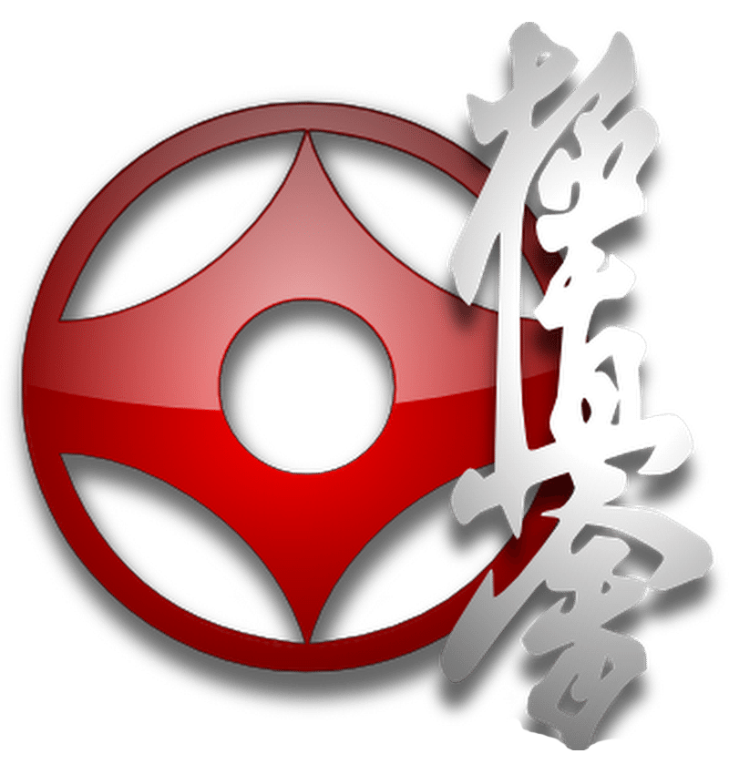

# Kyokushin Karate Landing Page

Este é um projeto simples de uma landing page para um site de Kyokushin Karate. A página foi criada usando HTML, CSS e um pouco de JavaScript (opcional). Vamos explicar cada parte do código de forma fácil de entender, para quem está começando ou tem conhecimento intermediário.

## Estrutura Geral do Projeto

O projeto tem as seguintes pastas e arquivos:

- `index.html`: O arquivo principal da página web.
- `css/style.css`: O arquivo de estilos para deixar a página bonita.
- `js/script.js`: Arquivo de JavaScript para funcionalidades extras (não usado na versão atual).
- `img/`: Pasta com imagens, como o logo e fundo.

## Explicação do HTML (index.html)

O HTML é a estrutura da página. Ele define o que aparece na tela.

### Cabeçalho (Header)

```html
<header>
  <nav class="navbar">
    
    <div class="nav-links">
      <a href="#home">Home</a>
      <a href="#about">Sobre</a>
      <a href="#techniques">Técnicas</a>
      <a href="#training">Treinamento</a>
      <a href="#contact">Contato</a>
    </div>
    <button id="login">Login</button>
  </nav>
</header>
```

- `<header>`: Parte de cima da página, fica fixa no topo.
- `<nav>`: Navegação, com links para seções da página.
- ``: Logo do site.
- `<a>`: Links que levam para seções da mesma página (âncoras).
- `<button>`: Botão para login.

### Conteúdo Principal (Main)

```html
<main>
  <section id="home" class="hero">
    <h1>
      DOMINE A FORÇA DO <br />
      KARATE KYOKUSHIN
    </h1>
    <p>Treine o caminho da verdade, e supere seus limites</p>
    <div class="button-group">
      <button id="registro">Registrar-se</button>
      <button id="saiba-mais">Saiba Mais</button>
    </div>
  </section>

  <section id="about" class="about">
    <div class="container">
      <h2>Sobre o Kyokushin Karate</h2>
      <p>Texto explicativo sobre o Karate.</p>
    </div>
  </section>

  <!-- Outras seções: techniques, training, contact -->
</main>
```

- `<main>`: Conteúdo principal da página.
- `<section>`: Seções da página, como hero (parte inicial), about (sobre), etc.
- `id`: Identificador único para cada seção, usado nos links de navegação.
- `<h1>`, `<h2>`: Títulos, h1 é o principal.
- `<p>`: Parágrafos de texto.
- `<div>`: Contêineres para agrupar elementos.

### Rodapé (Footer)

```html
<footer>
  <p>&copy; 2026 Kyokushin Karate. All rights reserved.</p>
  <div class="footer-links">
    <a href="privacy.html">Privacy Policy</a>
    <a href="#contact">Contato</a>
  </div>
</footer>
```

- `<footer>`: Parte de baixo da página, com direitos autorais e links.

## Explicação do CSS (style.css)

O CSS deixa a página bonita, controlando cores, tamanhos e layouts.

### Variáveis (Root)

```css
:root {
  --bg-color: #1a1a1a;
  --accent-red: #b30000;
  --gold: #d4af37;
  --text-white: #e0e0e0;
  --neon-glow: 0 0 5px rgba(212, 175, 55, 0.5);
}
```

- Define cores e valores reutilizáveis, como variáveis. Facilita mudanças.

### Estilos Gerais

```css
* {
  margin: 0;
  padding: 0;
  box-sizing: border-box;
}

body {
  font-family: "Roboto", sans-serif;
  background:
    linear-gradient(rgba(0, 0, 0, 0.4), rgba(0, 0, 0, 0.4)),
    url("../img/bg.png");
  background-size: cover;
  color: var(--text-white);
}
```

- `*`: Reseta margens e paddings de todos os elementos.
- `body`: Estilo do corpo da página, com fonte, fundo e cor do texto.

### Header e Navegação

```css
header {
  background: rgba(0, 0, 0, 0.85);
  position: fixed;
  width: 100%;
  box-shadow: var(--neon-glow);
}

.navbar {
  display: flex;
  justify-content: space-between;
  align-items: center;
}

.nav-links a:hover {
  color: var(--gold);
  text-shadow: 0 0 10px var(--gold);
}
```

- `header`: Barra superior fixa.
- `navbar`: Layout flexível para logo, links e botão.
- `hover`: Efeitos ao passar o mouse, como mudança de cor e brilho neon.

### Seções

```css
.hero {
  height: 80vh;
  display: flex;
  flex-direction: column;
  justify-content: center;
  text-align: center;
}

.about,
.techniques,
.training,
.contact {
  padding: 60px 0;
  background: rgba(0, 0, 0, 0.5);
}

.technique-grid {
  display: grid;
  grid-template-columns: repeat(auto-fit, minmax(250px, 1fr));
  gap: 20px;
}
```

- `hero`: Seção inicial, centralizada verticalmente.
- Outras seções: Fundo semi-transparente, padding para espaço.
- `grid`: Layout em grade para as técnicas, se ajusta automaticamente.

### Botões

```css
.button-group button {
  padding: 12px 30px;
  background: var(--accent-red);
  border: none;
  transition: 0.4s;
}

button:hover {
  transform: scale(1.05);
  box-shadow: 0 0 15px var(--accent-red);
}
```

- Estilo dos botões, com transições suaves e efeitos de brilho ao hover.

### Responsividade

```css
@media (max-width: 768px) {
  .hero h1 {
    font-size: 2.5rem;
  }
  .navbar {
    flex-direction: column;
  }
}
```

- Ajustes para telas menores, como fonte menor e layout vertical.

## Como Usar

1. Abra o `index.html` em um navegador.
2. Navegue pelas seções usando os links no topo.
3. Para editar, mude o HTML ou CSS e recarregue a página.

## Dicas para Aprender

- **HTML**: Estrutura básica. Pratique criando mais seções.
- **CSS**: Estilos visuais. Experimente mudar cores ou adicionar animações.
- **Variáveis**: Use :root para facilitar manutenção.
- **Flexbox/Grid**: Para layouts responsivos.

Este projeto é simples e pode ser expandido com mais funcionalidades!</content>
<parameter name="filePath">c:\xampp\htdocs\GitHub\Kyokushin Karate\README.md
